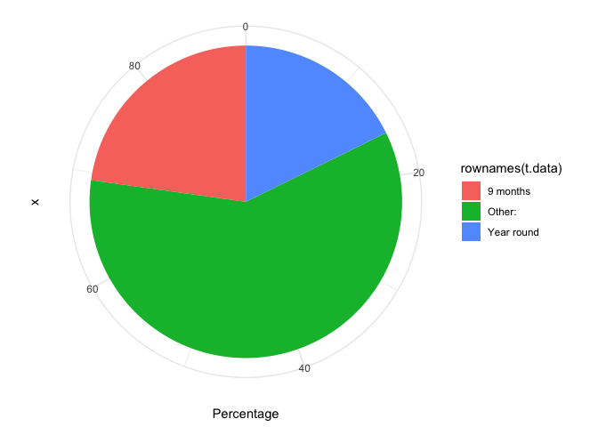
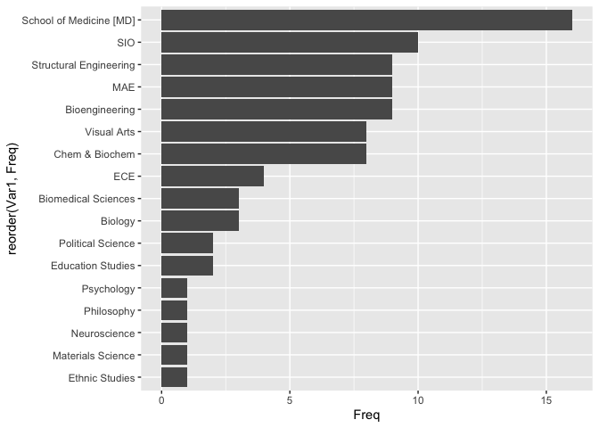
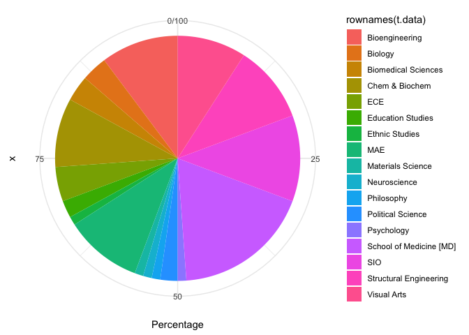
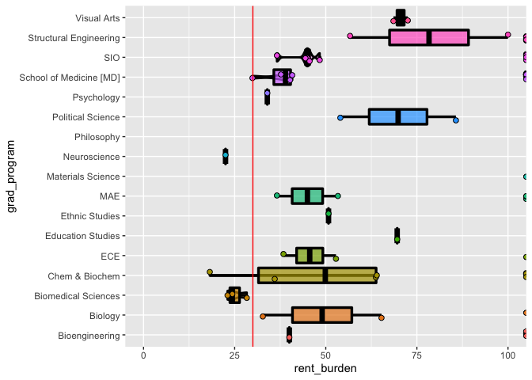
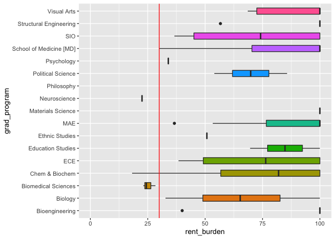
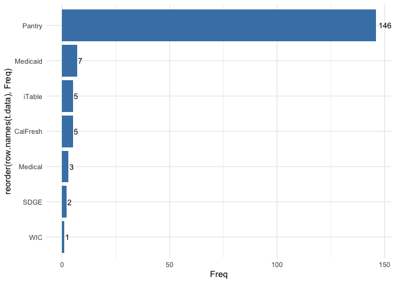

UCSD\_COL\_survey\_2020
================
Gabriel Ascui
5/23/2020

## UCSD Cost-of-Living GSA survey 2020

Data collection and survey design by Laura Chapman (Biological Sciences
PhD) and Analyzed by Gabriel Ascui (Biomedical Sciences PhD) and Axel
Wenzel (Bioinformatics PhD)

Version
3.0.0

### Load Data:

``` r
data <- read.delim(file = "grad_data_censored.tsv", row.names = NULL, check.names = FALSE)
data[,-c(1)] -> data
```

## Libraries

Data wragglying based on
    `tidyverse`.

``` r
library(tidyverse)
```

    ## ── Attaching packages ───────────────────────────────────────────────────────────────────────────────────────────────────────────────────────────────────────────────── tidyverse 1.3.0 ──

    ## ✓ ggplot2 3.3.1     ✓ purrr   0.3.4
    ## ✓ tibble  3.0.1     ✓ dplyr   1.0.0
    ## ✓ tidyr   1.1.0     ✓ stringr 1.4.0
    ## ✓ readr   1.3.1     ✓ forcats 0.5.0

    ## ── Conflicts ──────────────────────────────────────────────────────────────────────────────────────────────────────────────────────────────────────────────────── tidyverse_conflicts() ──
    ## x dplyr::filter() masks stats::filter()
    ## x dplyr::lag()    masks stats::lag()

``` r
library(ggplot2)
library(knitr)
library(scales) # for percent()
```

    ## 
    ## Attaching package: 'scales'

    ## The following object is masked from 'package:purrr':
    ## 
    ##     discard

    ## The following object is masked from 'package:readr':
    ## 
    ##     col_factor

``` r
library(ggrepel)
library(choroplethr)
```

    ## Loading required package: acs

    ## Loading required package: XML

    ## 
    ## Attaching package: 'acs'

    ## The following object is masked from 'package:dplyr':
    ## 
    ##     combine

    ## The following object is masked from 'package:base':
    ## 
    ##     apply

``` r
library(choroplethrZip)
library(viridis)
```

    ## Loading required package: viridisLite

    ## 
    ## Attaching package: 'viridis'

    ## The following object is masked from 'package:scales':
    ## 
    ##     viridis_pal

# Sample Description

*Total Answers per graduate program*

`t.data` is a table to summary all the answers so for per graduate
program

``` r
t.data <- data.frame(table(data$grad_program))
sum(t.data$Freq)
```

    ## [1] 941

``` r
ggplot(t.data, aes(reorder(Var1, Freq), Freq)) + geom_bar(stat="identity") + coord_flip()
```

<!-- -->

## PhD Sample Primarily Finacial Supported

How are you primarily finacially supported in your graduate program?

``` r
phd.data <- data %>% filter(deg_type_CAT == "PhD")
t.data <- table(phd.data$support_period_CAT)
addmargins(t.data)
```

    ## 
    ##              9 months     Other: Year round        Sum 
    ##          1        278         35        539        853

``` r
t.data <- cbind(t.data, prop.table(t.data)*100)
colnames(t.data) <- c("Freq", "Percentage")
t.data <- as.data.frame(t.data)
t.data[-1,] -> t.data 
ggplot(t.data, aes(x = "", Percentage, fill=rownames(t.data))) + geom_bar(width = 1, stat = "identity") + coord_polar("y", start=0) + theme_minimal()
```

<!-- -->

``` r
head(t.data)
```

    ##            Freq Percentage
    ## 9 months    278  32.590856
    ## Other:       35   4.103165
    ## Year round  539  63.188746

## Other graduate students (MS/MAE/MD PhD/others)

``` r
other.data <- data %>% filter(deg_type_CAT != "PhD")
t.data <- table(other.data$support_period_CAT)
addmargins(t.data)
```

    ## 
    ##              9 months     Other: Year round        Sum 
    ##          9         18         47         14         88

``` r
t.data <- cbind(t.data, prop.table(t.data)*100)
colnames(t.data) <- c("Freq", "Percentage")
t.data <- as.data.frame(t.data)
t.data[-1,] -> t.data 
ggplot(t.data, aes(x = "", Percentage, fill=rownames(t.data))) + geom_bar(width = 1, stat = "identity") + coord_polar("y", start=0) + theme_minimal()
```

<!-- -->

``` r
head(t.data)
```

    ##            Freq Percentage
    ## 9 months     18   20.45455
    ## Other:       47   53.40909
    ## Year round   14   15.90909

``` r
## other programs bar_graph responses per program
t.data <- data.frame(table(other.data$grad_program))
sum(t.data$Freq)
```

    ## [1] 88

``` r
ggplot(t.data, aes(reorder(Var1, Freq), Freq)) + geom_bar(stat="identity") + coord_flip()
```

<!-- -->

``` r
## other programs pie_graph responses per program
t.data <- table(other.data$grad_program)
addmargins(t.data)
```

    ## 
    ##          Bioengineering                 Biology     Biomedical Sciences 
    ##                       9                       3                       3 
    ##          Chem & Biochem                     ECE       Education Studies 
    ##                       8                       4                       2 
    ##          Ethnic Studies                     MAE       Materials Science 
    ##                       1                       9                       1 
    ##            Neuroscience              Philosophy       Political Science 
    ##                       1                       1                       2 
    ##              Psychology School of Medicine [MD]                     SIO 
    ##                       1                      16                      10 
    ##  Structural Engineering             Visual Arts                     Sum 
    ##                       9                       8                      88

``` r
t.data <- cbind(t.data, prop.table(t.data)*100)
colnames(t.data) <- c("Freq", "Percentage")
t.data <- as.data.frame(t.data)
ggplot(t.data, aes(x = "", Percentage, fill=rownames(t.data))) + geom_bar(width = 1, stat = "identity") + coord_polar("y", start=0) + theme_minimal()
```

<!-- -->

# Other than PhDs (MS/MA/etc)

## Rent Burden Calculations

``` r
other.data$income <- parse_number(as.character(other.data$grad_prog_comp), )
```

    ## Warning: 4 parsing failures.
    ## row col expected                                actual
    ##  15  -- a number None                                 
    ##  18  -- a number -                                    
    ##  31  -- a number Program costs and variable employment
    ##  42  -- a number ?

``` r
other.data$h_expense <- parse_number(as.character(other.data$rent_month))
```

    ## Warning: 2 parsing failures.
    ## row col expected                                           actual
    ##  10  -- a number Homeless                                        
    ##  24  -- a number I live with family because I can not afford rent

``` r
other.data$rent_burden <- as.numeric(round((other.data$h_expense/(other.data$income/12))*100, 2))
```

## Rent burden box\_plots

``` r
other.data %>% 
  ggplot(aes(x = grad_program, y = rent_burden, fill = grad_program)) + 
  geom_violin(alpha=0.4, position = position_dodge(width = 1.75),size=1,color="black") +
  geom_boxplot(outlier.size = 1, color="black",lwd=1.2, alpha = 0.7, ) +
  geom_point( shape = 21,size=2, position = position_jitterdodge(), color="black",alpha=1) +
  guides(fill=FALSE) + 
  ylim(0,100) + 
  geom_hline(yintercept = 30, colour = "red") +
  coord_flip()
```

    ## Warning: Removed 55 rows containing non-finite values (stat_ydensity).

    ## Warning: Removed 55 rows containing non-finite values (stat_boxplot).

    ## Warning: Removed 20 rows containing missing values (geom_point).

<!-- -->

93 out of 138 responders indicate they do not recieve any compensations
from UCSD. ***\#\# check these number for new dataset\!\!\! 55/88***

If we assume that rent burden is higher than 100% when there is no
salary, we generate the following graph. ***This assumption may not be
correct.***

``` r
other.data %>% mutate(rent_burden = ifelse(rent_burden > 100, 100, rent_burden)) -> other.data ## assuming rent burden as 100% if no salary

other.data %>% 
  ggplot(aes(x = grad_program, y = rent_burden, fill = grad_program)) + 
  #geom_violin() + 
  geom_boxplot(width=0.5) + 
  guides(fill=FALSE) + 
  ylim(0,100) + 
  geom_hline(yintercept = 30, colour = "red") +
  coord_flip()
```

    ## Warning: Removed 9 rows containing non-finite values (stat_boxplot).

<!-- -->

``` r
## this assumption may not be the correct
```

# PhD Students sample

## Summary current resident on/off-campus

``` r
t.data <- data.frame(table(phd.data$on_campus))
t.data$perc <- t.data$Freq/sum(t.data$Freq)*100
ggplot(t.data, aes(reorder(Var1, Freq), perc, fill = Var1)) + geom_bar(stat="identity") + coord_flip() + theme(legend.position = "none")
```

<!-- -->

``` r
t.data
```

    ##                                  Var1 Freq       perc
    ## 1 Do not currently have a stable home    3  0.3516999
    ## 2             Off-campus (lease/rent)  460 53.9273154
    ## 3                    Off-campus (own)   22  2.5791325
    ## 4                 Off-campus (sublet)   13  1.5240328
    ## 5              On-campus (lease/rent)  353 41.3833529
    ## 6                  On-campus (sublet)    2  0.2344666

## Map of Housing of UCSD PhD students

Zip codes of our UCSD PhD student sample.

``` r
## Download source file, unzip and extract into table
ZipCodeSourceFile = "http://download.geonames.org/export/zip/US.zip"
temp <- tempfile()
download.file(ZipCodeSourceFile , temp)
ZipCodes <- read.table(unz(temp, "US.txt"), sep="\t")
unlink(temp)
names(ZipCodes) = c("CountryCode", "zip", "PlaceName", 
"AdminName1", "AdminCode1", "AdminName2", "AdminCode2", 
"AdminName3", "AdminCode3", "latitude", "longitude", "accuracy")
## phd.df$zip_code
ZC <- data.frame(table(phd.data$zip))
colnames(ZC) <- c("zip", "Freq")
ZC_Info = merge(ZC, ZipCodes[,c(2:6,10:11)])
ZC_Info$Percentage <- round((ZC_Info$Freq/sum(ZC_Info$Freq))*100, 2)
ZC_Info %>% filter(AdminName2 == "San Diego") %>% select(region = zip, value = Freq, PlaceName, AdminName2) -> z.df
## missing San Diego zip_codes
m_zip <- data.frame(
  region = as.factor(c(92027, 92066, 91934, 91917, 92061, 91910, 92134, 92060, 91915, 91963, 92028, 92086, 92119, 92135, 92145, 92173, 92154, 91906, 91916, 92003, 92007, 91948, 92672, 92010, 92019, 92021, 92029, 92057, 92059, 92078, 92091, 92114, 92124, 92118, 91914, 92084, 92025, 92054, 92069, 91935, 91913, 92128, 91978, 91931, 91905, 92139, 91932, 91980, 92004, 92036, 92055, 92065, 92070, 92082, 92147, 92140, 92132, 92155, 91962, 92040, 92014, 92011, 92008, 92064, 92071, 91902, 92127, 92129, 92120)),
  value = 0
)  ## replace this with all the SD AdminName2 from the ZipCodes object minus the zip codes in z.df ## should lookup the rest of the zipcodes for easier graph thing.
z.df <- bind_rows(z.df, m_zip)
## plot
zip_choropleth(z.df, title = "Zip Code UCSD Students",
               num_colors = 9,
               msa_zoom  = "San Diego-Carlsbad, CA",
               legend = "# UCSD PhD"
               )
```

    ## Warning in super$initialize(zip.map, user.df): Your data.frame contains the
    ## following regions which are not mappable: 92085, 92092, 92093

<!-- -->

this doesn’t work as well because zip\_codes from San Diego County were
redistributed recently…….. Need to update package….

## Average Income per PhD program.

`phd.data` is a data.frame with only the data of PhD students.

## Rent Burden Calculations

``` r
phd.data$income <- parse_number(as.character(phd.data$grad_prog_comp), )
```

    ## Warning: 4 parsing failures.
    ## row col expected                 actual
    ## 115  -- a number not enough            
    ## 137  -- a number .                     
    ## 664  -- a number Only tuition remission
    ## 811  -- a number Not guaranteed

``` r
phd.data$h_expense <- parse_number(as.character(phd.data$rent_month))
phd.data$rent_burden <- as.numeric(round((phd.data$h_expense/(phd.data$income/12))*100, 2))
```

## PhD program compensation

``` r
ggplot(phd.data, aes(reorder(grad_program, FUN = median, income), income, fill=grad_program)) + geom_boxplot(outlier.colour="black", outlier.shape=NA,
             outlier.size=2, notch=FALSE) + guides(fill=FALSE) + coord_flip() + theme_classic() + ylim(0,40000)
```

    ## Warning: Removed 11 rows containing non-finite values (stat_boxplot).

<!-- -->

## Rent burden of PhD Students

``` r
## Plot
phd.data %>% 
  ggplot(aes(x = primary_fin_sup_CAT, y = rent_burden, fill = primary_fin_sup_CAT)) + 
  geom_violin(position = position_dodge(width = 3.75)) + 
  geom_boxplot(width=0.25) + 
  geom_point(shape = 21,size=1.2, position = position_jitterdodge(jitter.width = 0.8), color="black",alpha=0.5) +
  guides(fill=FALSE) + ylim(0,100) + geom_hline(yintercept = 30, colour = "red") +
  coord_flip()
```

    ## Warning: Removed 57 rows containing non-finite values (stat_ydensity).

    ## Warning: Removed 57 rows containing non-finite values (stat_boxplot).

    ## Warning: Removed 49 rows containing missing values (geom_point).

<!-- -->

## Rent Burden vs Number of Dependents.

``` r
## first plot 
ggplot(phd.data, aes(x = on_campus, y = rent_burden, fill = n_dependents)) + geom_dotplot(binaxis='y', stackratio = 0.1, stackdir = 'center') +
  coord_flip() + theme_classic() + ylim(0,100)
```

    ## `stat_bindot()` using `bins = 30`. Pick better value with `binwidth`.

    ## Warning: Removed 57 rows containing non-finite values (stat_bindot).

<!-- -->

``` r
## second plot
phd.data %>% 
  filter(rent_burden < 100.1 & rent_burden > 0) %>% 
  ggplot(aes(x = on_campus, y = rent_burden, color = n_dependents)) +
  geom_count() + scale_size_area(max_size = 10) +
  scale_color_viridis(discrete = TRUE) +
  coord_flip()
```

<!-- -->

Concentration of PhD students with dependent living on-campus with high
rent burden.

## All PhD students rent burden violin\_graph

``` r
phd.data %>% 
  ggplot(aes(x = deg_type_CAT, y = rent_burden, fill = deg_type_CAT)) + 
  geom_violin() + 
  geom_boxplot(width=0.1) + 
  guides(fill=FALSE) + 
  ylim(0,100) + 
  geom_hline(yintercept = 30, colour = "red")
```

    ## Warning: Removed 57 rows containing non-finite values (stat_ydensity).

    ## Warning: Removed 57 rows containing non-finite values (stat_boxplot).

<!-- -->

57 non-finite values. (divided by 0)

## Statistics of Rent Burden of PhD Students

``` r
phd.data %>% filter(rent_burden < 100.1) -> f.phd
summary(f.phd$rent_burden)
```

    ##    Min. 1st Qu.  Median    Mean 3rd Qu.    Max. 
    ##    0.00   31.88   40.00   44.76   53.55  100.00

From all PhD students, median of `rent_burden` is 40.00%, mean is 44.77%
.

## UCSD PhD student Assitance usage

THe `grepl` function captures a pattern and gives a logical value.

``` r
phd.data$pub_assist_progs[phd.data$pub_assist_progs==""] <- NA
```

``` r
t.data = list()
sum(!is.na(phd.data$pub_assist_progs)) ## number of responses
```

    ## [1] 174

``` r
## numbers
phd.data$pub_assist_progs %>% grep(pattern = "Pantr", ignore.case = TRUE) %>% length() -> t.data[1] ## people using pantry
phd.data$pub_assist_progs %>% grep(pattern = "iTable", ignore.case = TRUE) %>% length() -> t.data[2]
phd.data$pub_assist_progs %>% grep(pattern = "Fresh", ignore.case = TRUE) %>% length() -> t.data[3]
phd.data$pub_assist_progs %>% grep(pattern = "SDG", ignore.case = TRUE) %>% length() -> t.data[4]
phd.data$pub_assist_progs %>% grep(pattern = "WIC", ignore.case = TRUE) %>% length() -> t.data[5]
phd.data$pub_assist_progs %>% grep(pattern = "Medicaid", ignore.case = TRUE) %>% length() -> t.data[6]
phd.data$pub_assist_progs %>% grep(pattern = "Medical", ignore.case = TRUE) %>% length() -> t.data[7]
t.data <- data.frame(t.data) 
colnames(t.data) <- c("Pantry", "iTable", "CalFresh", "SDGE","WIC", "Medicaid", "Medical")
t.data <- data.frame(t(t.data))
colnames(t.data) <- "Freq"
## we like the pantry!
t.data %>% 
  ggplot(aes(x = reorder(row.names(t.data), Freq), y = Freq)) + geom_bar(stat="identity", fill = "steelblue") + 
  geom_text(aes(label=Freq), hjust=-0.2, color="black", size=3.5) +
  theme_minimal() +
  coord_flip()
```

<!-- -->

174/858 PhD students uses public assistant programs.

## Rent Burden by program.

This is a messy graph.

``` r
## 

phd.data %>% 
  ggplot(aes(x = grad_program, y = rent_burden, fill = grad_program)) + 
  geom_violin() + 
  geom_boxplot(width=0.1) + 
  guides(fill=FALSE) + ylim(0,100) + geom_hline(yintercept = 30, colour = "red") +
  coord_flip() + theme(aspect.ratio = 1)
```

    ## Warning: Removed 57 rows containing non-finite values (stat_ydensity).

    ## Warning: Removed 57 rows containing non-finite values (stat_boxplot).

<!-- -->
